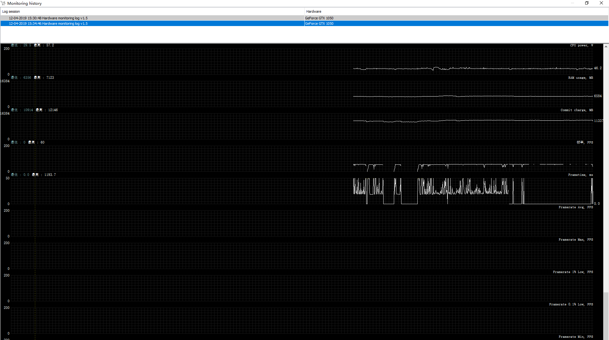

# tools for monitor pc performance

## tools

- [GPU-Z](https://www.techpowerup.com/gpuz/)
- [CPU-Z](https://www.cpuid.com/softwares/cpu-z.html)
- [HWMonitor](https://www.cpuid.com/softwares/hwmonitor.html)
- [Perfmonitor 2](https://www.cpuid.com/softwares/perfmonitor-2.html)
- [NZXT Cam](https://camwebapp.com/)
- [AgaueEye](http://xoptiray.com/)
- [MSI afterburner](https://www.msi.com/page/afterburner)
- [NVIDIA system monitor](https://www.nvidia.com/object/system_monitor.html) : outdated
- [EVGA Precision](https://www.evga.com/precisionx1/) : not ok

## GPU-Z

GPU-Z is a lightweight system utility designed to provide vital information about your video card and graphics processor.

Main Features
- Supports NVIDIA, AMD, ATI and Intel graphics devices
- Displays adapter, GPU and display information
- Displays overclock, default clocks and 3D clocks (if available)
- Includes a GPU load test to verify PCI-Express lane configuration
- Validation of results
- GPU-Z can create a backup of your graphics card BIOS
- No installation required, optional installer is available
- Support for Windows XP / Vista / Windows 7 / Windows 8 / Windows 10 (both 32 and 64 bit versions are supported)
- .. and yes, the author of CPU-Z has granted us permission to use a name similar to his product. Thanks Franck.

- GPU显存使用率
- GPU渲染核心占用率
- 可以输出成log文件

## CPUID softwares

### CPU-Z

CPU-Z is a freeware that gathers information on some of the main devices of your system : 
- Processor name and number, codename, process, package, cache levels.
- Mainboard and chipset.
- Memory type, size, timings, and module specifications (SPD).
- Real time measurement of each core's internal frequency, memory frequency.

- 硬件相关参数
- 只能记录单帧数据

### HWMonitor

HWMonitor is a hardware monitoring program that reads PC systems main health sensors : voltages, temperatures, fans speed.
The program handles the most common sensor chips, like ITE® IT87 series, most Winbond® ICs, and others. In addition, it can read modern CPUs on-die core thermal sensors, as well has hard drives temperature via S.M.A.R.T, and video card GPU temperature.

- 硬件相关数据
- 只能记录单帧数据

### PerfMonitor 2

PerfMonitor 2 (PM2) is a processor performance and monitoring tool. It allows to track up to 4 processor-related events choosen in a model-specific list. It succeeds to PerfMonitor, and in addition to that first version, PM2 includes monitoring data, like temperatures and powers.

- 只能显示处理器占用
- 不能导出记录
- 作用不大

## NZXT Cam

- 包含需要的性能数据
- 暂时无法获得数据log

## AgaueEye

- 包含需要的性能数据
- 有性能数据展示界面
- 有log数据（格式未知），可用于后续分析

## MSI afterburner

- 包含需要的性能数据
- 可以查看性能log
- 可提取log，用于后续分析
